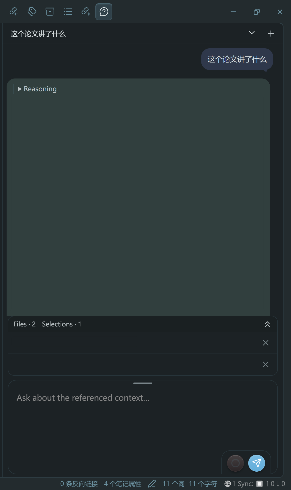

# Quick Ask

**简体中文** · [English](README.md)

[代码仓库](https://github.com/JM-FRANK/obsidian-quick-ask) · [发行版](https://github.com/JM-FRANK/obsidian-quick-ask/releases) · [更新日志](CHANGELOG.md)

在 Obsidian 侧栏中，直接向你明确选中的 Markdown 文字和文件提问。会话历史保存在本地，并由你控制哪些内容成为每次会话的上下文。



## 项目优势

- **轻量。** 单个专注的侧栏插件：安装体积约 1.3 MiB（gzip 约 306 KiB），无插件遥测，也没有开发者运营的后端。没有后台定时器或轮询，运行时不下载任何内容，只在你提交时连接提供方。会话是插件目录下的追加式 JSONL 纯文本文件——新会话不足 1 KB，并随你跟踪的全文增长——且始终不离开你的 Vault。
- **即时提问、即时回答。** 打开侧栏即可输入问题并提交；选中的文字与引用的文件一次暂存、一次发送。
- **顺手的拖拽交互。** 直接把选中的文字或文件从文件浏览器拖进输入区，发送前随时可移除任一暂存引用。
- **出色的界面表现。** 使用 Obsidian 原生控件，气泡随主题适配、推理可读，并可自定义显示风格（助手气泡色调、字号与段落间距）。
- **省 token 的上下文策略。** 由你决定什么进入会话；受跟踪的文件只发送发生变化的部分，长会话自动压缩，让每次请求都保持很小。

## 安装

Quick Ask 已上架 Obsidian 社区插件目录，推荐从中安装：

1. 打开 **设置 → 第三方插件 → 浏览**。
2. 搜索 **Quick Ask** 并选择**安装**。
3. 启用 **Quick Ask**，打开其设置并配置提供方，然后才能提交问题。

也可以从 [GitHub Releases](https://github.com/JM-FRANK/obsidian-quick-ask/releases) 手动安装：

1. 从 [Releases](https://github.com/JM-FRANK/obsidian-quick-ask/releases) 下载 `main.js`、`manifest.json` 和 `styles.css`。
2. 在你的 Vault 中创建 `.obsidian/plugins/quick-ask/` 目录（若自定义过配置目录，请使用实际目录）。
3. 将这三个文件复制到该目录，并在 **设置 → 第三方插件** 中启用 **Quick Ask**。
4. 打开 Quick Ask 设置并配置你的提供方，然后才能提交问题。

## 配置与使用

需要**桌面版 Obsidian 1.13.7+**。不支持移动端。设置使用 Obsidian 1.13 的声明式设置与命名密钥存储。

配置**请求协议**、**Base URL**、**模型**和**命名 API 密钥**。根据服务商支持情况显式选择 Responses（默认）或 Chat Completions。以 OpenAI 为例，Base URL 可填 `https://api.openai.com/v1`，不要追加 `/responses` 或 `/chat/completions`。协议修改只影响新会话，现有会话保留原协议；出错后不会自动切换。插件本身不包含任何模型或 API 访问权限。

Chat Completions 使用本地对话回放和模型生成的结构化摘要压缩，不支持服务端搜索；联网时请选择 DuckDuckGo 或已配置的独立搜索 API。

点击输入区内的思考程度文字，循环选择 Off / Low / High / XHigh / Max；也可通过 Ctrl+P 的“快速提问：切换思考程度”选择。默认 High，修改影响下一问，服务商决定是否支持所请求的档位。API 返回的 CC 可读思考文字会显示在 Reasoning 区。

新发送的文件上下文与全文工具结果包含物理行号，原始笔记不变。联网/思考程度切换先留在内存中，发起提问时才保存，因此未发送的选择不会跨插件重启保留。

选中 Markdown 文字或添加 Markdown 文件作为上下文，然后输入问题并提交。模型可以请求该会话中已包含文件的完整内容，但不能搜索任意文件，也不能编辑你的笔记。本版本不支持 PDF/图片输入。界面语言支持英文和简体中文，仍有部分界面文字为英文。

## 账号、费用与网络使用

插件本身免费，且不需要 Quick Ask 账号。你所选的 AI 提供方可能要求账号、API 密钥或付费额度；其 API 用量与价格另行计算。AI 聊天订阅不一定包含 API 访问权限。

Quick Ask 连接到你**配置的 Base URL**，例如 OpenAI 或其他兼容所选协议的服务。它会发送提示词、选中文字、被引用文件的内容和会话上下文，用于生成回答并支持 token 统计/压缩。在一次进行中的请求内，后续的模型/工具调用可能发送已添加文件的最新版本或完整内容。恢复或删除提供方存储的较早响应时，也会访问该配置的服务。仅打开/启用侧栏不会提交笔记内容。

插件不包含遥测、分析、广告，也没有开发者自建的独立后端。发送给提供方的数据适用其自身的保留与隐私政策；在使用敏感笔记前，请先查阅所选提供方的政策。插件不会自行安装/更新，也不会在运行时下载可执行依赖。

## 本地数据与隐私

- 偏好设置和一个**密钥引用**（而非 API 密钥值）保存在插件的 `data.json` 中。密钥值从 Obsidian 的密钥存储中解析。
- 会话及其包含的上下文以可读文件形式存放在插件目录的 `quick-ask/` 子目录中。本插件不对本地历史加密。
- 可选的保留副本会把明文备份写入你选择的 Vault 文件夹。剪贴板导出/导入包含会话内容，但不含密钥值。
- 插件只访问当前 Vault 中的文件和自己的插件数据目录，不读取 Vault 之外的文件。Vault 的同步/备份工具可能按各自配置复制这些文件。

## 开发

克隆本仓库即可进行本地开发或试用改动：

```sh
npm ci
npm run build
npm test
npm run check
```

遇到缺陷、疑问或功能建议，请[提交 issue](https://github.com/JM-FRANK/obsidian-quick-ask/issues)。优先推荐提 issue：先描述现象与复现方式，再讨论是否改代码。

## 许可

版权所有 2026 **FRANK-SMITH**。Quick Ask 采用 [Apache License 2.0](LICENSE) 许可；见 [NOTICE](NOTICE)。捆绑依赖保留其原始 MIT/BSD 许可，相关文本已收录于 `main.js` 和 [THIRD_PARTY_NOTICES.md](THIRD_PARTY_NOTICES.md)。
